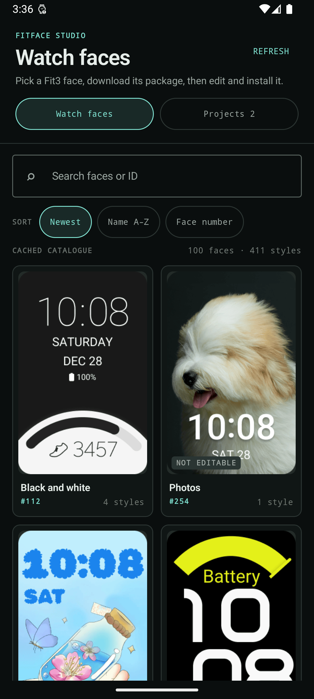
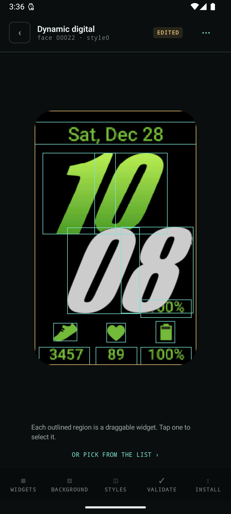
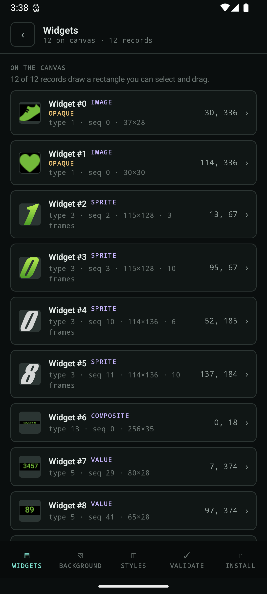
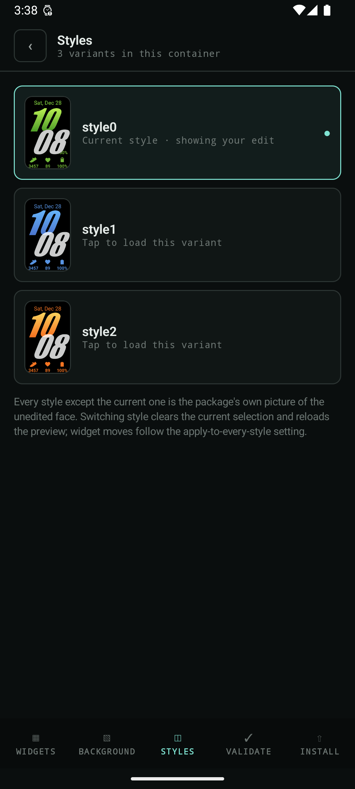
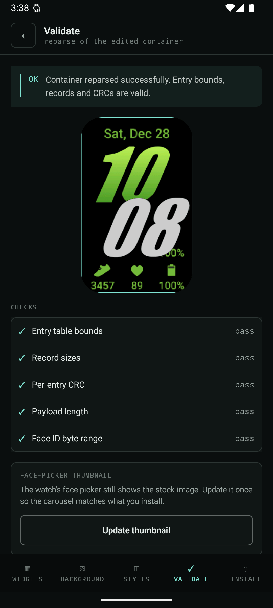
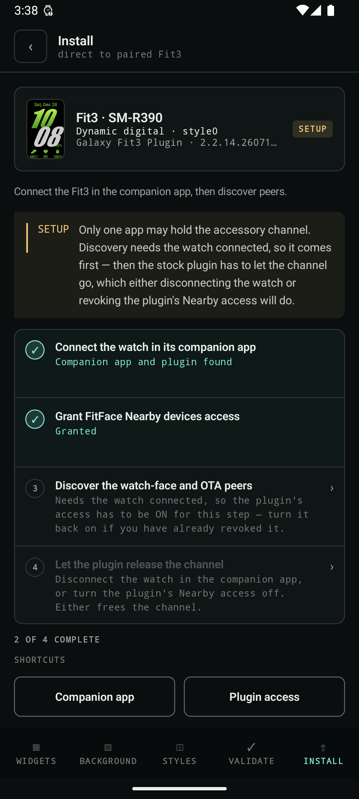
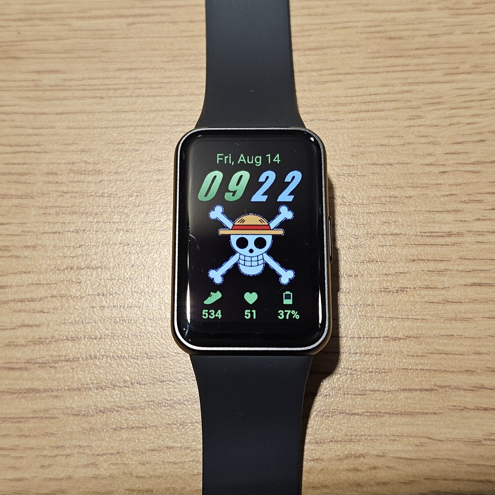

# FitFace Studio

[](https://github.com/satvikgosai/fitface-studio/releases)

An Android app for browsing, editing and installing Fit3 (SM-R390) watch faces.

Pick a face from the catalogue, change its background or move its widgets around,
check the result, and send it straight to your watch over Bluetooth. Nothing is
re-signed, re-packaged or installed as an app — the app edits the watch face's own
binary and hands the watch exactly those bytes.

The faces themselves are not in here. The app fetches each package from the device
vendor's own store API at runtime, into its own private storage; no watch-face package,
container or artwork is bundled with the app or redistributed by this repository.

It is an independent, experimental, personal-use project. It is **not affiliated
with, endorsed by, or connected to any device vendor**, and it will never be
published to an app store. See [`NOTICE.md`](NOTICE.md) and [`LICENSE`](LICENSE).

| | |
| --- | --- |
| Application ID | `dev.fitface.studio` |
| Version | `0.1.2` (code `18`) |
| Android | 9.0 (SDK 28) or newer |

## What it looks like

| Browse the catalogue | Edit the real layout | Every record, listed |
| --- | --- | --- |
|  |  |  |

| Styles, as pictures | Validate before install | Install over Bluetooth |
| --- | --- | --- |
|  |  |  |

The rest of the app is in [`docs/screenshots/`](docs/screenshots/): the face sheet
with its style picker, the inspector, the background replacement page, and the
projects list.

All ten of those are captured from an Android 16 emulator, so the watch is not
present and the Install page is on step 3 of its checklist. The last step is the one
an emulator cannot show:



A face sent from the app over Bluetooth, rendering on a real SM-R390 — no ADB, no
cable, nothing installed on the watch as an app.

The watch-face artwork in every image above belongs to its publishers and appears
only to show what the software does — see [`NOTICE.md`](NOTICE.md).

## What you can do

**Browse.** Search and sort the Fit3 catalogue by newest, name or face number.
Previews and the catalogue itself are cached on disk, so it opens instantly after
the first launch.

**Edit.** Open a face and you get its real layout on a canvas:

- replace the background with any photo, positioned by pinch and drag, or tint it —
  and on a face that never had one, add a background outright where the container
  has room for it under the size the watch accepts;
- drag a widget to move it, or hold a nudge button for one pixel at a time;
- resize a widget where that is safe, in 5% steps of the size it shipped at — so
  Smaller and Larger come back to the same place and the original is always
  reachable — and be told why when it is not;
- recolour widgets that store their own colour;
- duplicate or remove a widget, with removals kept in a **Removed** list you can
  restore from;
- switch between the face's styles — each one shown as a picture rather than a
  name, so you can see the colourway you are picking — and choose whether an edit
  applies to the style you are on or to every style that has the same widget.

Each widget row shows the widget itself and what kind of record it is — Image,
Sprite, Clock hand, Value, Rule, Composite, Arc or Bar — so you know what you are
about to change. Records the canvas cannot draw, like clock hands, are listed
separately and explained rather than quietly mixed in.

**Check.** The **Validate** page reparses the edited file and shows you what the
watch will actually render, plus every structural check. Install stays locked
until it is clean.

**Install.** Send the result to a paired, connected Fit3 over Bluetooth. No ADB,
no root, no cable.

Downloads and every committed edit are saved automatically to a private project
folder, so **Projects** reopens your work after the app is closed without
downloading again — each project listed with the face it holds. Deleting a project
deletes its private copy of the package and the edited file.

## What you need

- An Android phone running 9.0 or newer, with the watch's companion app and the
  stock Fit3 plugin installed.
- One Fit3 paired and connected.
- An Internet connection, for the catalogue and package downloads.

A debug APK is attached to each tag on the
[releases page](https://github.com/satvikgosai/fitface-studio/releases).

To build it yourself: Android Studio with its bundled JBR, Android SDK 36, and the
checked-in Gradle wrapper.

```bash
./gradlew \
  -Dorg.gradle.java.home='/Applications/Android Studio.app/Contents/jbr/Contents/Home' \
  :app:assembleDebug
```

The APK lands in `app/build/outputs/apk/debug/`. Full build and test instructions
are in [`docs/development.md`](docs/development.md).

`:core:delivery` also needs two accessory SDK JARs that are **not** in this
repository; the first build fetches them into `libs/` and verifies each against a
pinned SHA-256. That is a convenience, not a licence — see
[`libs/README.md`](libs/README.md).

## Installing to the watch

The **Install** page is a four-step checklist. Each step says what it does, and
the page refuses to go on while anything is missing.

1. Connect the watch in its companion app.
2. Grant FitFace Studio Nearby devices access.
3. Discover the watch-face and OTA peers. This needs the watch **connected**, so
   the stock plugin's Nearby access has to be **on** for this step.
4. Let the plugin release the channel, because only one app may hold it. Either
   disconnect the watch in the companion app, or turn the plugin's Nearby access
   off — the permission itself can stay granted. Then send.

Step 4 is the one people get stuck on: discovery needs the plugin, and the
transfer needs it to let go. Peer handles stay cached once found, so a second
install does not repeat the setup, and editing after an install re-arms the send
button instead of stranding the page. Reconnect the watch when the transfer
finishes, and restore the plugin's Nearby access if you turned it off.

If a send fails, the page offers **Reconnect the watch and discover again**
beside **Try again**. A cached peer only lives as long as the connection it was
found on, so anything that breaks after step 4 needs the watch connected again:
that button puts you back on step 3 with the checklist and the shortcuts you
need, without redoing the whole setup. Failures that can only mean a lost peer
take you back there on their own.

### Watch someone do it

VMG Channel recorded a walkthrough of the whole flow, from picking a face to it
rendering on the watch:

[**How to Install Custom Watchfaces on Galaxy Fit 3 (FINALLY!)**](https://youtu.be/ecUBemqNc9U)

[](https://youtu.be/ecUBemqNc9U)

It is a third-party video, made independently of this project and not endorsed by
it — the checklist in the app is the authority if the two ever disagree, since the
steps above change with the app and a recording does not.

## Scope and limits

The catalogue-to-watch path works end to end. Against the live 100-face
catalogue, 99 faces carry an editable container and all 99 parse, validate and
open; the hundredth (`00254`, "Photos") is a customisation companion with no
container at all and is labelled *Not editable* rather than failing at download.

This is research-grade software for one watch family. A structurally valid file
can still be rejected by different firmware, unavailable storage, battery state,
or watch-side policy. Delivery, background replacement, adding a background,
widget moves and sprite resizes have all been confirmed on an SM-R390; two
firmware limits found that way are enforced in the app — a container may not pass
4 MiB, and a sprite may not grow more than 128 px per side past what its face
shipped. Neither is documented anywhere, so treat both as measured rather than
specified. The photo above is one of those runs: a face sent from the app,
rendering on the watch.

## Documentation

- [`docs/`](docs/) — how it works inside: architecture, the container format, the
  editing model, the install protocol, and development setup.
- [`CONTRIBUTING.md`](CONTRIBUTING.md) — setup, tests, conventions, and what a
  change has to preserve.
- [`AGENTS.md`](AGENTS.md) — the traps that already bit this codebase.
- [`SECURITY.md`](SECURITY.md) — what to report privately, and what is out of scope.
- [`NOTICE.md`](NOTICE.md) — third-party components, vendor JARs, non-affiliation.

Related work: [galaxy-fit3-parser](https://github.com/Ahmadjerj/galaxy-fit3-parser)
is an independent read-only Python parser for the same container format, and it
renders previews of every style. Nothing here uses or derives from it — see
[`docs/bin-format.md` §14](docs/bin-format.md#14-related-work) for what it covers
and where it reaches further than this project's own derivation.

## Legal

Source is MIT — see [`LICENSE`](LICENSE). Non-affiliation, the third-party
components, what this repository does and does not distribute, and the terms of use
are all in [`NOTICE.md`](NOTICE.md). Read it before you use this on anything.
