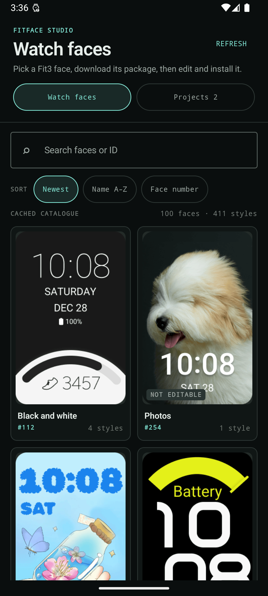
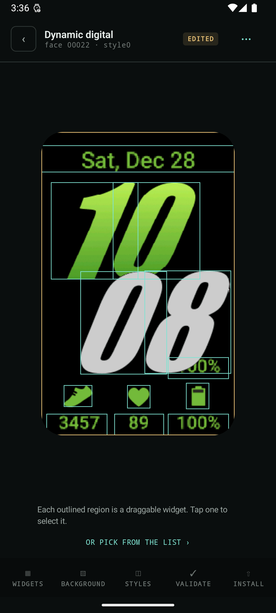
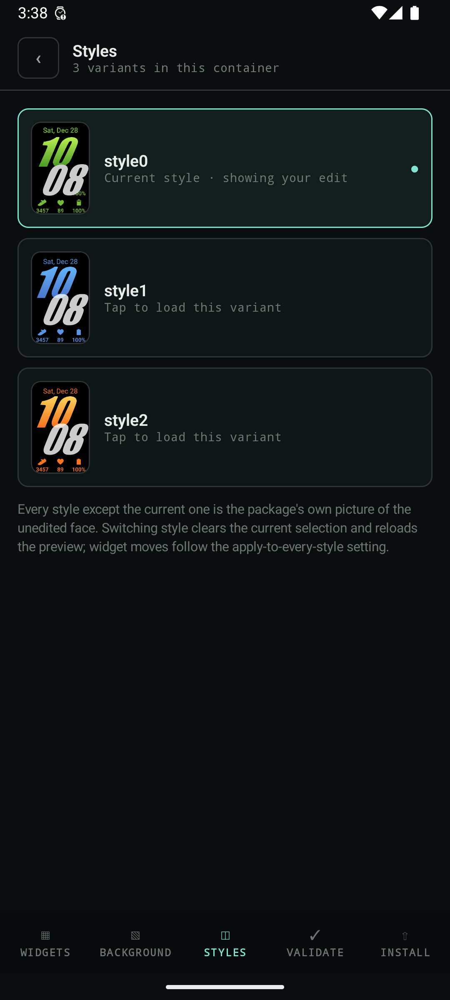
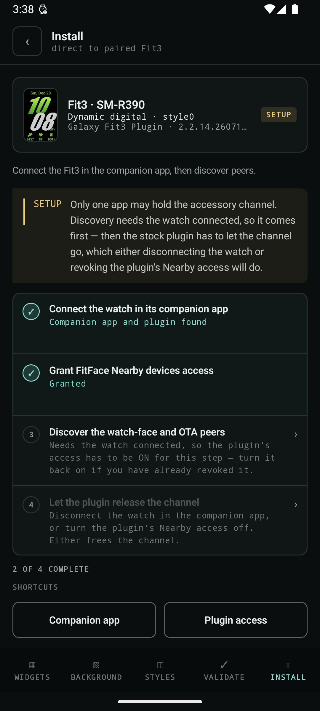
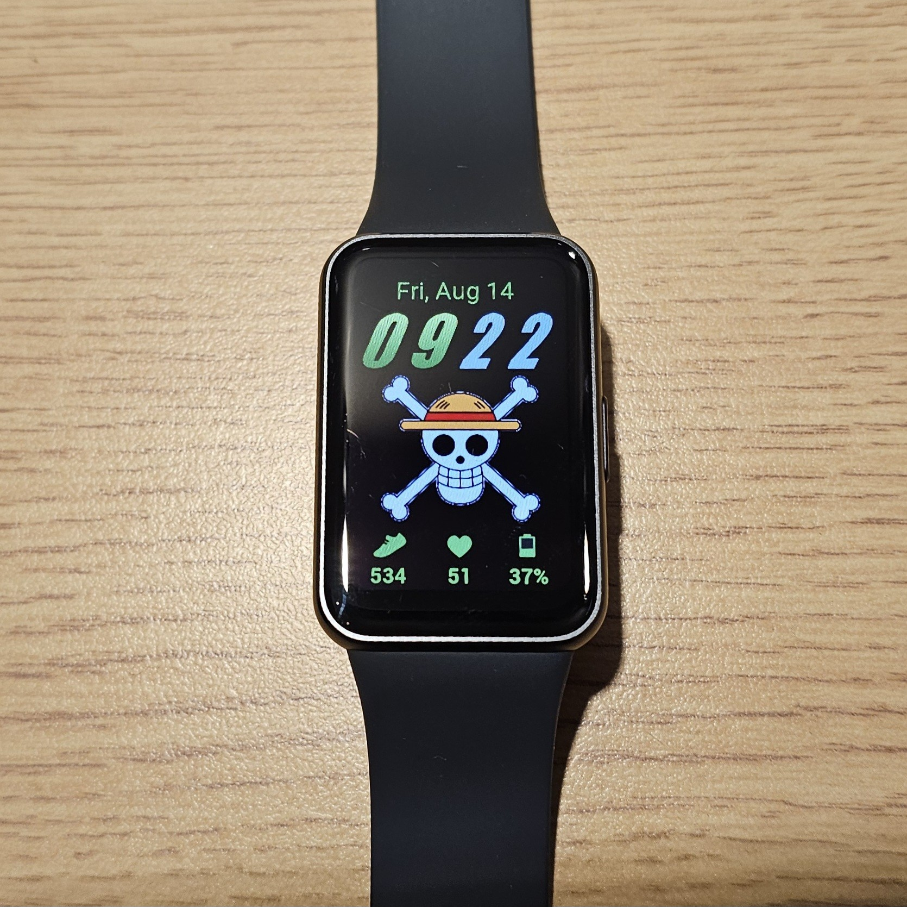

# FitFace Studio

[](https://github.com/satvikgosai/fitface-studio/releases)

| Application ID | `dev.fitface.studio` |
| --- | --- |
| Version | `0.2.1` (code `21`) |
| Android | 9.0 (SDK 28) or newer |

An Android app for browsing, editing and installing Fit3 (SM-R390) watch faces.
Pick a face, change its background or widgets, check the preview, and send it to
your watch over Bluetooth. Edits change the face's binary container; nothing is
re-signed or installed on the watch as an app.

Independent, experimental and for personal use. Not affiliated with or endorsed
by any device vendor. Face packages and artwork are fetched from the vendor's
store, never bundled here.

## What it looks like

These emulator screenshots show an earlier build; some labels and controls have changed.

<table>
  <tr>
    <th>Browse the catalogue</th>
    <th>Edit the real layout</th>
    <th>Styles, as pictures</th>
  </tr>
  <tr>
    <td align="center"></td>
    <td align="center"></td>
    <td align="center"></td>
  </tr>
  <tr>
    <th>Install over Bluetooth</th>
    <th colspan="2">On a real SM-R390</th>
  </tr>
  <tr>
    <td align="center"></td>
    <td colspan="2" align="center"></td>
  </tr>
</table>

The watch-face artwork belongs to its publishers and appears here to demonstrate
the app. The watch photo shows a real Bluetooth install.

## What you can do

- Search and sort the catalogue, or reopen saved projects without downloading again.
  Export a project to a ZIP file and import it later, on this phone or another.
- Replace or add a background where the face has room for it, including
  copying the background from another face.
- Move, resize, duplicate and remove supported widgets, and set text, lines and arc
  gauges to any colour. Restore removed stock widgets and add widgets from other faces.
  Arrange widgets in front of or behind each other. Rotate text, lines, arc gauges and
  pictures in 15° steps or to an exact angle, with an original-angle reset; pictures are
  redrawn from their original artwork.
- Edit the selected style, opt into matching widgets across styles, or edit the
  always-on display separately.
- Delete unused styles with an exact space-saving review, including when an edit
  needs more room under the watch's 4 MiB limit.
- Start a custom face with a clock on an empty panel. It uses the downloaded Info_4
  face as its base and replaces that face's slot on the watch.
- Review the preview and checks on **Install**, then send to a paired watch.

Edits save automatically to your project. The **EDITED** chip on Canvas identifies
a changed face.

The preview uses sample readings, not live watch data. Fonts can differ from the
watch, and some content cannot be previewed.

## Get the app

You need a paired Fit3 with its companion app and stock plugin installed on your phone.
Internet is needed for catalogue, package and app-update downloads.

Download the debug APK from [Releases](https://github.com/satvikgosai/fitface-studio/releases).
Open it on your phone, allow installation from that browser or file manager if
Android asks, and confirm installation. Check for updates from the app's menu.
Updates must use the same signing key; uninstalling deletes saved projects.

To build locally, install Android Studio and SDK 36, then use its bundled JBR
(adjust this macOS installation path for your system):

```bash
./gradlew \
  -Dorg.gradle.java.home='/Applications/Android Studio.app/Contents/jbr/Contents/Home' \
  :app:assembleDebug
```

The APK is in `app/build/outputs/apk/debug/`. The first build fetches two uncommitted
accessory SDK JARs; [Development](docs/development.md) covers setup and tests.

## Installing to the watch

Open the editor's **Install** page, review the preview and checks, then follow its
four-step checklist:

1. Connect the watch through its companion app.
2. Grant FitFace Studio **Nearby devices** access when requested on Android 12 or newer.
3. Discover both watch peers while the stock plugin is still connected.
4. Release the plugin's Bluetooth channel, then send. On Android 12 or newer, turn
   off the plugin's **Nearby devices** permission. For older phones, follow the
   [plugin-freezing guide](docs/direct-install.md#android-11-and-earlier-freezing-the-plugin).

Discovery needs the plugin connected; transfer needs it released. **Request sent**
means the request was delivered: check the result on the watch, restore the plugin
and reconnect. If the connection changes after discovery, use **Reconnect the watch
and discover again** before retrying.

### Watch someone do it

VMG Channel's independent [video walkthrough](https://youtu.be/ecUBemqNc9U) shows
the catalogue-to-watch flow. Follow the current app checklist if the video differs.

[](https://youtu.be/ecUBemqNc9U)

## Scope and limits

Faces without an editable container, such as “Photos”, show **Not editable**.
Several editing operations are watch-tested, but not every widget type or firmware is.
The app enforces the watch's 4 MiB container limit; detailed editing limits and
hardware coverage are in the [format reference](docs/bin-format.md#editing-contracts).

## Documentation

See the [documentation index](docs/README.md) for architecture, format/editing,
UI, delivery and development references. [Contributing](CONTRIBUTING.md) and
[AGENTS](AGENTS.md) cover working conventions;
[Changelog](CHANGELOG.md) records released user-facing changes.

Related independent work: [galaxy-fit3-parser](https://github.com/Ahmadjerj/galaxy-fit3-parser).
The [format reference](docs/bin-format.md#14-related-work) describes its scope;
this project's parser was independently derived.

## Legal

Project source is licensed under [MIT](LICENSE). Vendor SDKs and watch-face content
remain subject to their owners' terms; this project grants no rights in them.
[NOTICE.md](NOTICE.md) covers non-affiliation, third-party components and terms of use.
Use only faces you are authorised to modify on hardware you own. There is no warranty.
